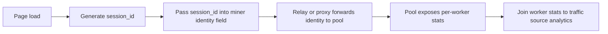

# Browser Mining Script Merge Validation and Final Unified Output

## Executive Summary

The updated master table has **three** scripts worth carrying forward after Tasks 1–10: **opd-ai/webminer**, **PiTi2k5/Crypto-Webminer**, and **MarcoCiaramella/cpu-web-miner**. Of those three, only **opd-ai/webminer** is clearly aligned with your stated deployment model of **consent-first, self-hosted, browser-native, RandomX/XMR-focused monetization**; however, its **worker/session plumbing is not first-class or cleanly documented**, so out-of-the-box per-session attribution is still a real gap. **cpu-web-miner** has the **best explicit worker/session field and best callback surface**, but it is **GhostRider-oriented rather than RandomX**, and the current implementation depends on a **third-party WebSocket relay**. **Crypto-Webminer** is the strongest validated **GhostRider** browser miner and does support worker-style identity patterns, but for your exact analytics-heavy deployment it has a fatal scaling caveat: its own docs warn that **many unique worker names under one wallet create separate pool connections and can trigger bans**. citeturn7view0turn8view7turn13view0turn14view0turn15view0turn16view0turn18view0turn18view1turn22search0turn22search1

The biggest corrections versus the three agent reports are these. **CoinIMP should not be in the qualifying table** for this brief: its current official positioning is **MintMe JavaScript mining**, and its own site says Monero browser mining stopped being profitable after the 2019 algorithm change; its docs are framed as **MintMe JavaScript mining configuration**, not RandomX/GhostRider. **cpu-web-miner should be reinstated** from Grok’s exclusions: its official README and source expose **GhostRider support**, an explicit **`stratum.worker`** field, and browser callbacks. **NajmAjmal/monero-webminer should remain excluded** because the repo does **not** show qualifying post-November-2024 activity in this pass. citeturn4view3turn4view5turn4view6turn18view0turn18view1turn22search1turn6view4turn0search3turn6view2turn6view5

My direct recommendation is this: **name the winner as `opd-ai/webminer`**, but only as a **conditional winner**. It is the best strategic fit for your exact deployment because it is current, consent-first, auditable, self-hostable, RandomX/XMR-oriented, and already includes health monitoring and restart logic. But before commitment, you need one short engineering checkpoint: **prove or patch explicit worker-name support** so the host page can set `session_id` deterministically before mining starts. If you refuse any patching and need **clean worker-per-session tracking immediately**, then **cpu-web-miner** becomes the better tactical choice, but that means accepting **GhostRider-first economics and a relay dependency**, which is not what your original brief prioritized. citeturn5view0turn7view0turn9view1turn12view6turn13view0turn6view4turn18view0turn18view1

## Assumptions and Scope

The uploaded prompt file and the three uploaded agent files were treated as the controlling inputs. Where those files made claims that conflicted with current official sources, I overrode them with the official sources. Where the attachments did not specify a detail and I could not verify it directly, I mark it **unspecified** or **unverified** rather than inventing it.

Two limits matter here. First, some hosted browser-mining bundles are opaque or only partially inspectable in this environment, so **health/restart APIs for hosted scripts remain weaker-confidence than repo-backed source claims**. Second, I could validate blocker status against public mining blocklists, but I could **not** directly query live current verdicts from Chrome Safe Browsing or Microsoft Defender reputation systems for every domain in this pass, so those parts are necessarily framed as current public evidence plus cautious inference. citeturn28view0turn4view6

## Metadata Summary

- **Claude Cowork** — qualifying scripts listed: **3** (`opd-ai/webminer`, `CoinIMP`, `Crypto-Webminer`); excluded scripts listed in Section 2: **12 rows** even though metadata says **8**; GhostRider result: **YES**, with **Crypto-Webminer**.
- **Gemini** — qualifying scripts listed: **3** (`Crypto-Webminer`, `cpu-web-miner`, `monero-webminer`); excluded scripts listed: **4**; GhostRider result: **YES**, with **Crypto-Webminer** and **cpu-web-miner**.
- **Grok** — qualifying scripts listed: **2** (`opd-ai/webminer`, `Crypto-Webminer`); excluded scripts listed: **8**; GhostRider result: **YES**, with **Crypto-Webminer**.

## Master Merged Table

<table>
<thead>
<tr>
<th>Name + Link</th>
<th>Last Update Date</th>
<th>Supported Coin(s)</th>
<th>Supported Algo(s)</th>
<th>Open / Closed Source</th>
<th>Features & Settings</th>
<th>User Feedback / Reviews</th>
<th>Contact / Discord</th>
<th>Deployment Method</th>
<th>License + Commercial Terms</th>
<th>Pool Compatibility</th>
<th>Worker / Session ID Implementation</th>
<th>JS API / Callbacks</th>
<th>CPU Throttle Control</th>
<th>WASM vs JS Performance Delta</th>
<th>Known Blocker Status</th>
<th>Mobile Browser Support</th>
<th>Multi-tab Behavior</th>
<th>Health & Status API</th>
<th>AV / Safe Browsing Reputation</th>
<th>Pros</th>
<th>Cons</th>
<th>Comments / Highlights</th>
<th>Found By</th>
<th>Merge Confidence</th>
</tr>
</thead>
<tbody>
<tr>
<td><strong>opd-ai/webminer</strong><br>github.com/opd-ai/webminer</td>
<td>Oct 8, 2025</td>
<td>XMR</td>
<td>RandomX</td>
<td>Open source; repo license state is <strong>⚠️ inconsistent</strong></td>
<td>Consent-first; single-file; Web Workers; monitoring; battery/thermal logic; auto-reconnect</td>
<td>Limited public adoption visible</td>
<td>GitHub issues</td>
<td>Self-hosted JS; WebSocket-to-Stratum proxy required</td>
<td>No platform fee found; license wording conflict <strong>⚠️</strong></td>
<td>Standard pools via proxy</td>
<td><strong>⚠️ No explicit documented workerName field</strong>; only possible via undocumented login-string workaround</td>
<td><code>WebMiner.init()</code>, <code>start()</code>, <code>stop()</code>, <code>pauseMining()</code>, <code>resumeMining()</code>, <code>getStats()</code>, <code>restartWorker()</code>; docs/events vs code exposure not fully aligned <strong>⚠️</strong></td>
<td>Yes</td>
<td>WASM + JS fallback; no formal benchmark found</td>
<td>Self-hosting reduces domain-list blocking; heuristic AV risk remains</td>
<td>Yes, with explicit device protections</td>
<td>No built-in cross-tab dedupe verified</td>
<td>Stats, health score, restart logic; no clean documented stall callback</td>
<td>Heuristic risk; no current direct vendor verdict verified here</td>
<td>Best consent fit; auditable; RandomX/XMR aligned; self-hostable</td>
<td>Worker/session attribution is not clean out of the box</td>
<td>Best strategic fit if you will verify or patch worker naming</td>
<td>Claude, Grok</td>
<td>MED</td>
</tr>
<tr>
<td><strong>PiTi2k5/Crypto-Webminer</strong><br>github.com/PiTi2k5/Crypto-Webminer</td>
<td>Oct 7, 2025</td>
<td>RTM, XMR payout via MoneroOcean, many others</td>
<td>GhostRider, Flex, MinotaurX, x16RT, Allium, CPUPOWER, CN family; RandomX is <strong>PoC</strong></td>
<td>Open source</td>
<td>Custom pools; hosted or self-host; auto-algo modes; script-tag deployment</td>
<td>Long-running niche project</td>
<td>Discord + site + GitHub</td>
<td>Hosted script tags or self-hosting</td>
<td>MIT; 1% dev fee</td>
<td>Custom pools via query params; warns on high-cardinality worker usage</td>
<td>Supports worker/paymentID-style identity in wallet/password patterns, but <strong>⚠️ many unique workers create separate pool connections</strong></td>
<td><code>EverythingIsLife(...)</code>; broader host-page callbacks undocumented <strong>⚠️</strong></td>
<td>Yes</td>
<td>No formal benchmark found</td>
<td>Hosted domains explicitly appear in mining blocklists; self-hosting helps only partly</td>
<td>Yes</td>
<td>No built-in dedupe verified</td>
<td>UI stats/status visible; host-page health/restart API undocumented <strong>⚠️</strong></td>
<td>Hosted domains have poor public blocker reputation</td>
<td>Only fully validated GhostRider webminer in this set; worker naming supported</td>
<td>Scale-hostile for many session workers; RandomX only PoC</td>
<td>Good specialist option, weak large-scale analytics fit</td>
<td>Claude, Gemini, Grok</td>
<td>HIGH</td>
</tr>
<tr>
<td><strong>MarcoCiaramella/cpu-web-miner</strong><br>github.com/MarcoCiaramella/cpu-web-miner</td>
<td>Jan 4, 2026</td>
<td>GhostRider/yes* family coins; not XMR/RandomX</td>
<td>GhostRider, yespower, yescrypt, minotaurx, power2B, others</td>
<td>Open source</td>
<td>ESM/npm browser integration; Web Workers; browser callbacks</td>
<td>Small niche footprint</td>
<td>GitHub; Discord badge/link in README</td>
<td>Import as ESM or npm package into browser frontend</td>
<td><strong>⚠️ Fee docs conflict: 1% in GitHub README vs 10% in npm readme</strong></td>
<td>Configurable target pool through a hardcoded third-party relay</td>
<td><strong>Explicit <code>stratum.worker</code> field</strong></td>
<td><code>start(algo, stratum, ..., onWork, onHashrate, onError)</code>; stop/restart flow not fully documented in public README</td>
<td>Thread count only; no real throttle % control verified</td>
<td>Unspecified</td>
<td>Bundling/self-hosting helps; mining heuristics still apply</td>
<td>Unspecified / browser-dependent</td>
<td>No built-in dedupe verified</td>
<td>Good callback surface for watchdogs; explicit restart flow under-documented</td>
<td>Public blocklist visibility lower than CoinIMP/Crypto-Webminer, but still mining code</td>
<td>Best clean worker/session field; best explicit callback surface</td>
<td>No RandomX; relay dependency; fee ambiguity</td>
<td>Best tactical session-tracking plumbing, weaker strategic fit to your XMR brief</td>
<td>Gemini; Grok listed it as excluded</td>
<td>MED</td>
</tr>
</tbody>
</table>

**Row evidence.** `opd-ai/webminer` shows active commits in October 2025, a consent-first RandomX single-file design, a documented proxy requirement, and `getStats()` / `restartWorker()` support; but the current public init/config surface only exposes `pool`, `wallet`, and `throttle`, while the raw code logs into the pool with `login: walletAddress` and injects only an internal random `worker_id`, which means explicit host-controlled worker naming is not first-class in the current public surface. citeturn5view0turn7view0turn8view7turn9view1turn12view6turn13view0turn13view3

`Crypto-Webminer` has 2025 commits, explicit GhostRider support, “RandomX as test algo - proof of concept,” a Discord/community surface, and direct documentation that `samewallet.differentworkername` or different passwords are treated as separate pool connections; its integration page also documents worker/paymentID patterns in the passed address string. Its hosted domains and related mining-path patterns are explicitly present in the NoCoin filter list. citeturn6view0turn6view3turn14view0turn15view0turn15view1turn15view3turn16view0turn28view0

`cpu-web-miner` shows late-2024 and January-2026 activity, explicit GhostRider support, an exposed `stratum.worker` field, and callback-driven browser integration. The current public documentation conflicts on fee level: GitHub says 1%, while npm says 10%. The source also hardcodes a relay connection to `wss://websocket-stratum-server.com`, so its current deployment model depends on third-party infrastructure unless you fork or replace that layer. citeturn6view1turn6view4turn18view0turn18view1turn22search0turn22search1

## Validation and Scoring

### Conflict Log

| Script Name | Col # | Column Name | Agent A Value | Agent B Value | Your Verdict | Reasoning |
|---|---:|---|---|---|---|---|
| opd-ai/webminer | 2 | Last Update Date | Claude: needs verification | Grok: Oct 2025 active | **Oct 8, 2025** | GitHub commit history shows multiple commits on Oct 8, 2025. citeturn5view0 |
| opd-ai/webminer | 5 / 10 | Open source / license | Grok: permissive open source | Claude: license unverified | **Open source, license still inconsistent ⚠️** | Public README says license info will be provided later, while raw script header says MIT. That is not clean enough to call resolved. citeturn7view0turn11view0 |
| opd-ai/webminer | 12 | Worker / Session ID | Agents leaned “likely” or “needs verification” | — | **Not first-class; treat as undocumented / ambiguous ⚠️** | Public config exposes `wallet`, not `worker`; raw code submits `login: walletAddress` and creates its own random internal `worker_id`. Host-controlled per-session worker naming is therefore not documented as a clean supported feature. citeturn8view7turn13view0 |
| opd-ai/webminer | 19 | Health & Status API | Grok: strong monitoring/events | Claude: needs verification | **Partial health API; not fully proven** | `getStats()` and `restartWorker()` are real, but the stronger event/callback story is not fully corroborated in the exposed code. citeturn9view1turn12view6 |
| CoinIMP | 3 / 4 | Supported coins / algos | Claude: possible RandomX history | Gemini: wrong algo, exclude | **Exclude CoinIMP** | Official site says CoinIMP mines MintMe and says Monero browser mining stopped being profitable after the 2019 change; docs are explicitly “MintMe JavaScript mining configuration.” citeturn4view3turn4view5turn4view7 |
| CoinIMP | 16 | Blocker status | Claude: vendor claim contradicted | — | **Hosted CoinIMP is blocklist-visible** | CoinIMP claims it “isn't blocked,” but NoCoin lists both `coinimp.com` and `coinimp.net` and related delivery domains. citeturn4view6turn28view0 |
| Crypto-Webminer | 2 | Last Update Date | Claude: uncertain / maybe stale | Gemini/Grok: active | **Active in 2025** | Commit history shows Oct 2025, Sep 2025, and Nov 2024 activity. citeturn6view0turn6view3 |
| Crypto-Webminer | 12 | Worker / Session ID | Claude/Grok: likely supported | Gemini: explicit | **Supported, but scale-hostile ⚠️** | README explicitly documents `samewallet.differentworkername`; integration docs show worker/paymentID patterns. But the same docs warn that many different workers under one wallet create separate pool connections and can lead to bans. citeturn15view0turn16view0 |
| Crypto-Webminer | 19 | Health & Status API | Agents implied stats/status | — | **Weak / undocumented for host-page control ⚠️** | Public UI exposes hashrate, accepted shares, and status, but a clean host-page health/restart API was not documented in the sources inspected here. citeturn15view7turn16view0 |
| cpu-web-miner | Qualification | Included by Gemini, excluded by Grok | Grok: insufficient | Gemini: qualifying | **Reinstate** | Official README and source expose GhostRider support, explicit `worker`, and callbacks; commits extend into Jan 2026. citeturn18view0turn18view1turn6view4turn22search1 |
| cpu-web-miner | 10 | Commercial Terms | Gemini: 1% | npm snippet: 10% | **Unresolved fee conflict ⚠️** | GitHub README says 1%; npm readme says 10%. I would not sign this off without maintainer confirmation. citeturn18view0turn22search0 |
| monero-webminer | Qualification | Gemini: qualifying | Claude/Grok: exclude for staleness | **Exclude** | The repo does not show qualifying post-November-2024 activity in this pass; latest visible commit dates are in 2024 and earlier. citeturn0search3turn6view2turn6view5 |

### Critical Column Validation

| Script | Column 12 — Worker / Session ID | Column 16 — Known Blocker Status | Column 19 — Health & Status API | Overall Validation |
|---|---|---|---|---|
| opd-ai/webminer | **Weak / ambiguous**. No first-class worker field exposed; only possible via wallet/login-string hack. | **Moderate**. Self-hosting genuinely helps against named domain blocklists; heuristic AV risk still real. | **Moderate**. `getStats()`, health score, restart logic exist; stall detection still needs your own watchdog. | **PARTIAL** |
| Crypto-Webminer | **Strong-but-risky**. Worker/paymentID patterns are real, but many unique workers create separate pool connections and ban risk. | **Weak for hosted mode**. Known public mining domains are on NoCoin lists; self-hosting only partly mitigates. | **Weak**. Public UI status exists; clean host-page API/restart semantics not documented. | **PARTIAL** |
| cpu-web-miner | **Strong**. Explicit `stratum.worker` field. | **Moderate**. Less public blocklist evidence than CoinIMP/Crypto-Webminer, but still mining-related code. | **Moderate-to-strong**. Callback model supports watchdogs; restart/ops flow remains partly undocumented. | **PARTIAL** |

The single biggest Task-3 finding is blunt: **none of the surviving candidates are fully production-clean on all three critical columns at once**. `opd-ai/webminer` wins on consent, RandomX fit, self-hosting, and health controls, but **not** on explicit session worker naming. `cpu-web-miner` wins on worker/session ID and callbacks, but **not** on your primary algorithm or infrastructure control. `Crypto-Webminer` supports worker-ish identity but its own docs warn that your exact high-cardinality session model can turn into a pool-abuse problem. citeturn8view7turn13view0turn15view0turn16view0turn18view0turn18view1



That chain is the real design test. With `opd-ai/webminer`, the chain is weakest at **C** because worker naming is not first-class. With `Crypto-Webminer`, the chain reaches **E**, but breaks operationally when **high-cardinality workers** create too many pool-side connections. With `cpu-web-miner`, the chain reaches **E** most cleanly, but **D** depends on a third-party relay you do not currently control. citeturn13view0turn15view0turn16view0turn18view1

### Session Tracking Chain Validation

```text
Script: opd-ai/webminer
Chain: page load → session_id generated → must be forced into wallet/login string manually before WebMiner.init → proxy receives login string → pool receives whatever the login string contains → pool API may expose per-worker stats if the chosen pool parses the suffix → traffic attribution
Broken links: YES — there is no first-class documented workerName parameter; current public code logs in with walletAddress and uses an internal random worker_id for share submission internals
Verdict: PARTIALLY VIABLE
```

```text
Script: PiTi2k5/Crypto-Webminer
Chain: page load → session_id generated → inject into EverythingIsLife() address/password using worker/paymentID syntax → backend opens pool connection using that identity → pool receives distinct worker/paymentID → pool stats attribution → traffic source join
Broken links: YES — not because worker identity is impossible, but because the project explicitly warns that many unique workers under one wallet are not bundled and can cause wallet/pool bans
Verdict: PARTIALLY VIABLE
```

```text
Script: MarcoCiaramella/cpu-web-miner
Chain: page load → session_id generated → set stratum.worker = session_id → browser code sends stratum object to relay → relay opens pool connection with that worker → pool per-worker stats can attribute hashes → traffic source join
Broken links: YES — session chain itself is clean, but deployment reliability depends on a hardcoded third-party WebSocket relay unless you fork/replace it
Verdict: PARTIALLY VIABLE
```

These are the core session-tracking facts, not marketing. If your next stage assumes a script already gives you **guaranteed worker-per-session attribution plus robust health monitoring plus safe scale**, that assumption is wrong. All three need at least one engineering or operational concession. citeturn13view0turn15view0turn16view0turn18view0turn18view1

### Deployment Scores Table

| Script | Session Tracking | Scale Readiness | Health Observability | Blocker Resistance | Total /20 |
|---|---:|---:|---:|---:|---:|
| opd-ai/webminer | 2 | 4 | 4 | 3 | **13** |
| PiTi2k5/Crypto-Webminer | 4 | 1 | 2 | 1 | **8** |
| MarcoCiaramella/cpu-web-miner | 5 | 2 | 4 | 3 | **14** |

**Why these scores look like this.** `cpu-web-miner` scores highest numerically because it has the cleanest explicit worker field and callback surface. That does **not** make it the strategic winner for your brief, because the scoring rubric does not include “RandomX/XMR fit” as a separate axis. `opd-ai/webminer` keeps the best strategic position because it is the only current candidate that is simultaneously **consent-first**, **RandomX/XMR-oriented**, **self-host-friendly**, and **not already infamous as a hosted mining script domain**. `Crypto-Webminer` falls hard on scale and blocker resistance because the project itself warns about high-cardinality workers and public filter lists explicitly name its hosted domains. citeturn7view0turn13view0turn15view0turn16view0turn18view0turn18view1turn28view0

### GhostRider Consensus

All three agent outputs correctly converged on the big point: **GhostRider browser mining is not zero — it does exist — but the field is extremely narrow.** The strongest validated GhostRider browser implementations in this pass are **PiTi2k5/Crypto-Webminer** and **MarcoCiaramella/cpu-web-miner**. The former is the more established web-mining project; the latter has the cleaner explicit browser API. citeturn14view0turn15view1turn18view0turn18view1

Two clarifications matter. First, **Crypto-Webminer** does indeed expose `?algo=ghostrider/native` and positions itself as a GhostRider web-mining solution. Second, **cpu-web-miner** should not have been dismissed as a non-qualifier by Grok, because the official README and source very clearly list **`ghostrider`** and expose browser-side usage. citeturn14view0turn15view1turn18view0turn18view1

## Recommended Shortlist

**Recommended winner: `opd-ai/webminer`.**  
It wins because it is the only script here that actually fits the spirit and the architecture of your intended deployment: **consent-first design, self-hostability, auditable code, active 2025 maintenance, RandomX/XMR alignment, and meaningful built-in monitoring/restart logic**. The catch is big and non-negotiable: **do not move to production until you prove or patch explicit worker/session naming**. Right now that part is still weaker than it needs to be for your analytics model. citeturn5view0turn7view0turn9view1turn12view6turn13view0

**Second: `cpu-web-miner`.**  
If the decision criterion is **“I need programmatic worker-per-session tracking now”**, this is the cleanest one. It exposes `stratum.worker` directly and gives you `onWork`, `onHashrate`, and `onError` hooks for watchdog logic. But it is second because it is **not the primary algorithm fit** for your brief and it currently depends on a **third-party relay**, plus its fee documentation is internally inconsistent. citeturn18view0turn18view1turn22search0turn22search1

**Third: `Crypto-Webminer`.**  
This is the GhostRider specialist. It supports worker-style identity patterns, has active 2025 commits, and remains the strongest validated GhostRider browser miner in the set. But for your exact deployment it is the most dangerous one operationally, because the script’s own docs warn that lots of unique workers under one wallet are not bundled and can trigger pool or wallet bans. Add the public blocklist exposure of its hosted domains, and it becomes a constrained fallback rather than a front-runner. citeturn6view3turn15view0turn16view0turn28view0

**Direct developer-contact questions before any commitment:**
- `opd-ai/webminer`: Is there a supported `worker` or `workerName` config field, or should the wallet/login string be overloaded intentionally?
- `cpu-web-miner`: What is the **real** current fee — 1% or 10% — and can the relay be self-hosted or replaced cleanly?
- `Crypto-Webminer`: What is the maintainer’s recommended upper bound for unique workers per wallet before pool-side bans become likely?

## ChatGPT Additions and Independent Discovery

### ChatGPT Additions

I did **not** find a genuinely qualifying additional browser mining script beyond the agent universe that I can honestly stand behind for this brief. I am not adding a fabricated “maybe” candidate just to fill the slot.

### Independent Discovery

Setting the agent outputs aside, I still did **not** identify another browser-based JS/WASM miner that simultaneously meets all four of your Task-10 conditions: **not already mentioned by the agents, RandomX or GhostRider support, activity since roughly November 2024, and programmatic worker-name-per-session support**.

The closest modern near-miss I encountered is **`randomx.js`**, but it does **not** qualify here. It is an actively maintained RandomX implementation with recent npm activity and a browser mining example, but it is fundamentally an **algorithm/library layer**, not a clearly documented production browser miner with pool-integrated worker/session identity semantics. It was also already surfaced by the agents, so it would fail Task 10 either way. citeturn24view0turn24view1turn26view0

### Verify Excluded Scripts

| Script Name | Exclusion Reason Given | Your Verdict | Action |
|---|---|---|---|
| CoinIMP / MintMe | WRONG_ALGO | Correct | **CONFIRMED EXCLUDED** |
| Vectra Project / WebRandomX | NO_WORKER_ID | Correct | **CONFIRMED EXCLUDED** |
| RandomX.js | NO_WORKER_ID / library only | Correct | **CONFIRMED EXCLUDED** |
| XMRig | NOT_BROWSER | Correct | **CONFIRMED EXCLUDED** |
| WebMinePool / notgiven688/webminerpool | NO_UPDATE + WRONG_ALGO | Correct | **CONFIRMED EXCLUDED** |
| NajmAjmal/monero-webminer | NO_UPDATE | Correct | **CONFIRMED EXCLUDED** |
| MarcoCiaramella/cpu-web-miner | “Limited qualification depth” | Wrong | **REINSTATED** |
| MoneroOcean web miner | NOT_BROWSER | Plausible and unchanged in this pass | **CONFIRMED EXCLUDED** |
| xmrig-proxy | NOT_BROWSER | Correct | **CONFIRMED EXCLUDED** |
| jtgrassie/xmr-wasm | NO_UPDATE | Not independently re-checked in this pass | **NEEDS VERIFICATION** |
| ImL1s/xmrig-android web part | Hybrid / app-focused | Plausible, not independently re-checked | **NEEDS VERIFICATION** |
| craciuncezar/browser-cryptominer | NO_UPDATE | Not independently re-checked in this pass | **NEEDS VERIFICATION** |
| immrmonero/coin-imp wrapper | NOT_BROWSER | Plausible and consistent with description | **CONFIRMED EXCLUDED** |
| earnify.cc | Insufficient public documentation | Still unresolved | **NEEDS VERIFICATION** |
| Coinhive | DEFUNCT | Kept excluded; no reason to reinstate | **CONFIRMED EXCLUDED** |
| JSEcoin | DEFUNCT | Likely correct, but not independently re-checked here | **NEEDS VERIFICATION** |
| CryptoLoot | DEFUNCT | Likely correct, but not independently re-checked here | **NEEDS VERIFICATION** |
| Minero.cc | NO_UPDATE | Not independently re-checked here | **NEEDS VERIFICATION** |
| deepMiner | NO_UPDATE / defunct fork ecosystem | Plausible legacy exclusion | **NEEDS VERIFICATION** |
| Older CN-focused scripts / mixartemev bucket | NO_UPDATE or WRONG_ALGO | Non-specific row; cannot validate row as written | **NEEDS VERIFICATION** |

**High-confidence Task-9 judgments.** `CoinIMP` stays out because the current official docs and main site are MintMe-centric, not RandomX/GhostRider. `WebRandomX` stays out because its public WRXProxy configuration binds a central wallet on the server side and does not expose a clean per-session worker mechanism in the public materials inspected. `webminerpool` stays out because it is archived and its README explicitly says **“without randomX.”** `monero-webminer` stays out because it is stale against your recency bar. `cpu-web-miner` is the clear reinstatement because its official docs and source validate GhostRider, explicit worker support, and recent activity. citeturn4view3turn4view5turn23view1turn23view0turn1search1turn1search0turn0search3turn6view2turn6view5turn18view0turn18view1turn6view4

## Open Questions and Limitations

The main unresolved question is still the one that matters most for your deployment: **can `opd-ai/webminer` accept a host-controlled worker name cleanly, without abusing the wallet/login string and without diverging from intended upstream behavior?** If yes, it is the winner cleanly. If no, then it is still strategically attractive but not yet analytically safe for your next stage.

The second unresolved issue is commercial and operational, not academic: **`cpu-web-miner` currently has a fee-doc mismatch and a hardcoded relay dependency.** Until the maintainer resolves the 1% vs 10% contradiction and clarifies relay control, I would not treat it as a sign-off-ready production dependency.

Last thing: I updated the master table, shortlist logic, and verdicts around Tasks 9 and 10. But for a handful of legacy exclusions, I was deliberately conservative and marked **NEEDS VERIFICATION** where I could not independently re-check the current public state in this pass without stretching beyond high-confidence evidence. That is the right call here; better an honest unresolved row than fake certainty.